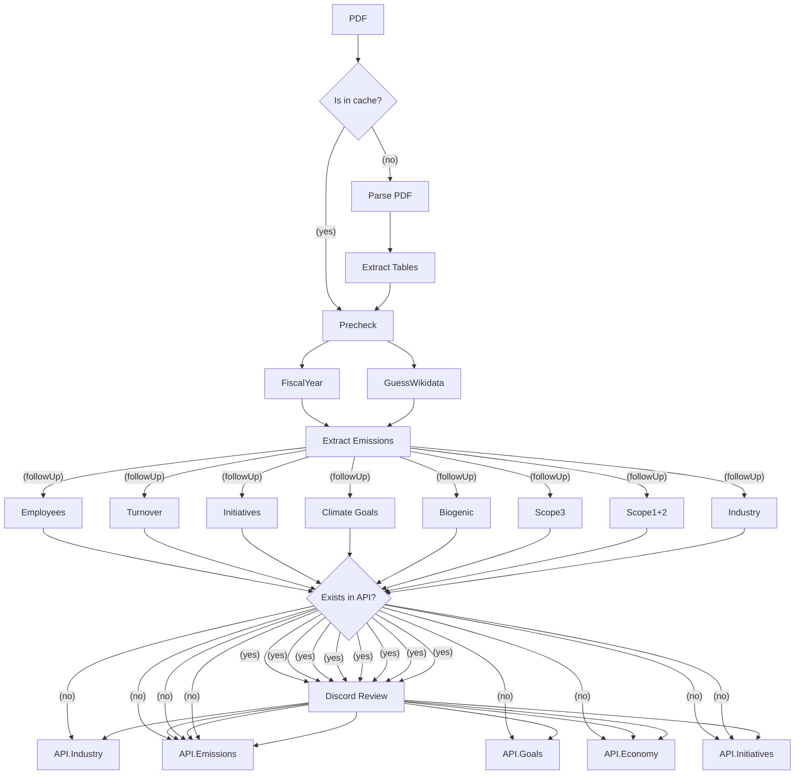

# Klimatkollen Garbo AI

This is the main repo for the AI bot we call Garbo. Garbo is a Discord bot that is powered by LLM:s to effectively fetch and extract GHG self-reported data from companies. It automates the process of data extraction, evaluation, and formatting, providing a streamlined workflow for handling environmental data.

Garbo is invoked through a set of commands in Discord and has a pipeline of tasks that will be started in order for her to both extract, evaluate and format the data autonomously.

We utilise an open source queue manager called BullMQ which relies on Redis. The data is then stored into DB and Wikidata.


## Current Status

Test the app in Discord channel #rapporter-att-granska by using the command /pdf <url> and Garbo will be answering with a parsed JSON

## Data Flow

Some of the following steps will be performed in parallel and most will be asynchronous. If a process is failed it's important to be able to restart it after a new code release so we can iterate on the prompts etc without having to restart the whole process again.



## Get started

Ensure you have Node.js version 22.0.0 or higher installed. You will also need Docker to run Redis, PostgreSQL, and ChromaDB containers.

### Setting up environment variables

Make a copy of the file `.env.example` and name it `.env.development`. Fill it in using the instructions in the file.

### Installing dependencies

```sh
npm i
```

> [!NOTE]
> If you use a Linux-based operating system, you might need to install additional dependencies for the third-party package `canvas`. Follow the [instructions](https://www.npmjs.com/package/canvas).

### Starting the containers

This project expects some containers running in the background to work properly. We use Postgres as our primary database, Redis for managing the queue system, ChromaDB for embeddings and the NLM ingestor for parsing PDF:s.

The simplest way to start the containers the first time is to run the following docker commands.

```bash
docker run -d -p 6379:6379 --name garbo_redis redis
docker run -d -p 5432:5432 --name garbo_postgres -e POSTGRES_PASSWORD=mysecretpassword postgres
docker run -d -p 8000:8000 --name garbo_chroma chromadb/chroma
docker run -d -p 5001:5001 --name garbo_ingestor ghcr.io/nlmatics/nlm-ingestor
```

Next time, you can start the containers back up using

```sh
docker start garbo_redis garbo_postgres garbo_chroma garbo_ingestor
```

You may want a graphical user interface to make it easier to manage your local containers. [Podman desktop](https://podman-desktop.io/) and [Rancher desktop](https://rancherdesktop.io/) are both good alternatives.

### Seeding the database for development

This applies migrations and seeding data needed for development.

```sh
npm run prisma migrate dev
```

### Starting the Garbo project in development mode

The code consists of two different starting points. You can start both the BullMQ queue UI, the API and the workers concurrently using:

```bash
npm run dev
```

This command will start both the dev-board and dev-workers concurrently. Now you can go to <http://localhost:3000> and see the dashboard.

If you want to run them separately, use the following commands:

To serve the BullMQ queue UI and the API:

```bash
npm run dev-board
```

To start the workers responsible for doing the actual work, which can be scaled horizontally:

```bash
npm run dev-workers
```

### Testing

To run the tests, use the following command:

```bash
npm test
```

### How to run with Docker

To run the application

```bash
docker run -d -p 3000:3000 ghcr.io/klimatbyran/garbo npm start

# start how many workers you want:
docker run -d ghcr.io/klimatbyran/garbo npm run workers
docker run -d ghcr.io/klimatbyran/garbo npm run workers
docker run -d ghcr.io/klimatbyran/garbo npm run workers

# first time you need to initialize the postgres database:
npm run prisma db push # create tables
npm run prisma db seed # seed the data with initial content
```

### Operations / DevOps

This application is deployed in production with Kubernetes and uses FluxCD as CD pipeline. The yaml files in the k8s is automatically synced to the cluster. If you want to run a fork of the application yourself - just add these helm charts as dependencies:

```helm
postgresql (bitnami)
redis (bitnami)
chromadb
metabase
```

To create secret in the k8s cluster - use this command to transfer your .env file as secret to the cluster:

```bash
kubectl create secret generic env --from-env-file=.env
```

### Contributing

We welcome contributions! Please see our [CONTRIBUTING.md](CONTRIBUTING.md) for guidelines on how to contribute to this project.

### Contact

For any questions or issues, please contact the maintainers at [hej@klimatkollen.se](mailto:hej@klimatkollen.se) and you will get an invite to our Discord.

### License

This project is licensed under the terms of the [MIT License](LICENSE) © Klimatbyrån Ideell Förening.
