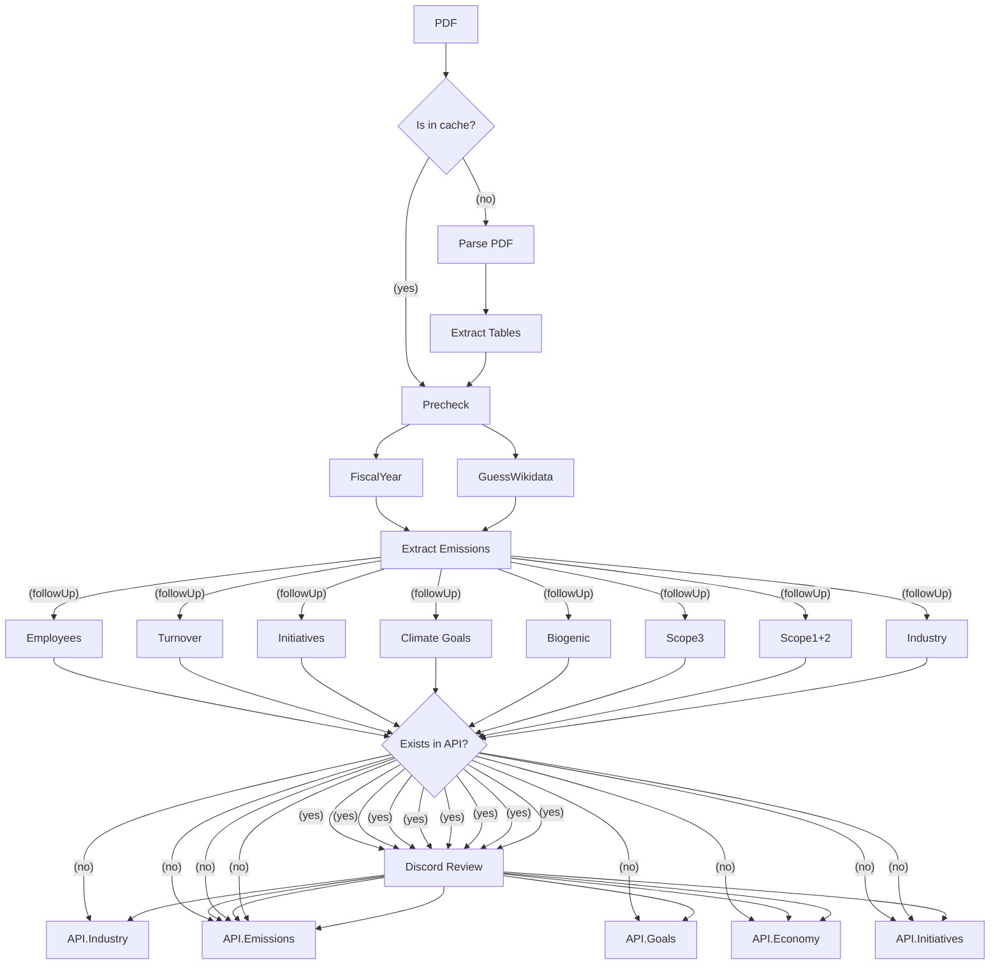

# Klimatkollen Garbo AI

This is the main repo for the AI bot we call Garbo. Garbo is a Discord bot that is powered by LLM:s to effectively fetch and extract GHG self-reported data from companies. It automates the process of data extraction, evaluation, and formatting, providing a streamlined workflow for handling environmental data

Garbo is invoked through a set of commands in Discord and has a pipeline of tasks that will be started in order for her to both extract, evaluate and format the data autonomously

We utilise an open source queue manager called BullMQ which relies on Redis. The data is then stored into DB and Wikidata.


## Current Status

Test the app in Discord channel #reports-to-check by using the command /pdf and Garbo will be answering with a parsed JSON.

## Data Flow

Some of the following steps will be performed in parallel and most will be asynchronous. If a process is failed it's important to be able to restart it after a new code release so we can iterate on the prompts etc without having to restart the whole process again.



## Get started 🚀

Ensure you have Node.js version 22.0.0 or higher installed. You will also need [Docker](https://www.docker.com/) (or [Podman](https://podman-desktop.io/)) to run containers.

### Setting up environment variables

Make a copy of the file `.env.example` and name it `.env`. Fill it in using the instructions in the file.

### Installing dependencies

```sh
npm i
```

> [!NOTE]
> If you use a Unix-based operating system, you might need to install additional dependencies for the third-party package `canvas` and `PDF2Image`. Follow the instructions at [canvas](https://www.npmjs.com/package/canvas) and [PDF2Image](https://github.com/yakovmeister/pdf2image/blob/HEAD/docs/gm-installation.md).

### Starting the containers

This project expects some containers running in the background to work properly. We use Postgres as our primary database, Redis for managing the queue system, ChromaDB for embeddings and the NLM ingestor for parsing PDF:s.

The simplest way to start the containers is to run the following docker commands.

```bash
docker-compose up
```

You may want a graphical user interface to make it easier to manage your local containers. [Podman desktop](https://podman-desktop.io/) and [Rancher desktop](https://rancherdesktop.io/) are both good alternatives

### Seeding the database for development

This applies migrations and seeding data needed for development. It also generates the prisma JS client and types, which are necessary to let prisma connect to the database.

```sh
npm run prisma migrate dev
```

### Optional: Restoring a database backup with test data

> [!NOTE]
> This step is very helpful to get a good starting point for developing and testing the frontend and/or the API. However, you may also skip it if you want to start with a clean database

First, ask one of the Klimatkollen team members and they will send you a database backup.

Not required the first time: Delete the database to make sure it doesn't exist:

```sh
docker exec -i garbo_postgres dropdb -f -U postgres --if-exists garbo
```

Then, replace `~/Downloads/backup_garbo_XYZ.dump` with the path to your DB backup file and restore the database backup with the following command:

```sh
docker exec -i garbo_postgres pg_restore -C -v -d postgres -U postgres < ~/Downloads/backup_garbo_XYZ.dump
```

### Starting the Garbo project in development mode

The code can be started in three main ways, depending on what you plan to develop/test/run locally.

#### 1) To serve only the API:

> [!NOTE]
> If you plan to develop the frontend and/or the API, this is the best way to get started:

```bash
npm run dev-api
```

This starts the API, and makes it possible to view the OpenAPI documentation at <http://localhost:3000/api>.

#### 2) To start the AI pipeline, BullMQ admin dashboard and the API:

If you plan to develop the AI pipeline, this is the recommended way to start the code.

First, run the following command to start the API and the queue system, including an admin dashboard to view progress, logs and more.

```bash
npm run dev-board
```

In addition to the accessing the local API, you can now view the BullMQ dashboard at <http://localhost:3000/admin/queues>.

The BullMQ dashboard is useful to develop and debug how garbo is extracting data from reports. A common workflow is to run a report through the garbo pipeline and then follow the progress in the BullMQ dashboard to view logs, errors and restart jobs. When updating code or prompts in the workers that make up what we call the garbo pipeline, it's possible to restart a job partway through the pipeline, to make it both easier and faster to iterate on changes.

Then, open another terminal and start the AI pipeline and its workers, which are responsible for processing each report. These can be scaled horizontally.

```bash
npm run dev-workers
```

#### 3) Starting everything concurrently

Get everything up and running with one command (with all output in one terminal).

```bash
npm run dev
```

#### 4) (Optional) Redis Insights

a). **Start Redis Insight**  
Run the following Docker command to start Redis Insight:

docker run -d --name redisinsight -p 5540:5540 redislabs/redisinsight:latest

---

b). **Connect Redis Insight to Redis**

- **Host**: `garbo_redis` (or the Redis container IP, e.g., `172.17.0.2`)
- **Port**: `6379`
- **Username**: Leave empty or use `default`.
- **Password**: Leave empty.

c). **Access Redis Insight**
Go to [http://localhost:5540](http://localhost:5540) in your browser and add the Redis database using the above connection details.

### Setup completed 🎉

Well done! You've now set up the `garbo` backend and are ready to start development :)

---

### How to make a backup of the local postgres DB

```sh
docker exec -i garbo_postgres pg_dump -U postgres -Fc -d garbo > ~/Downloads/backup_garbo_XYZ.dump
```

### Testing DB migrations

These steps can be useful to test DB migrations with data similar to the production environment.

1. Recommended: Create a local test DB. This allows you to keep your regular development DB intact.

```sh
docker run -d -p 5432:5432 --name garbo_test_postgres -e POSTGRES_PASSWORD=mysecretpassword postgres
```

Alternatively, make sure your local postgres container is running.

2. Ask one of the Klimatkollen team members and they will send you a database backup.

3. Delete the database if it exists:

```sh
docker exec -i garbo_test_postgres dropdb -f -U postgres --if-exists garbo
```

4. Restore the backup. This will initially connect to the default `postgres` database without making any modifications and then create any databases if they do not exist

```sh
docker exec -i garbo_test_postgres pg_restore -C -v -d postgres -U postgres < ~/Downloads/backup_garbo_XYZ.dump
```

5. Test the DB migrations with `npm run prisma migrate dev`.

6. Restart the Garbo API and workers and verify the migration was successful.

### Testing

To run the tests, use the following command:

```bash
npm test
```

### How to run with Docker

To run the application

```bash
docker run -d -p 3000:3000 ghcr.io/klimatbyran/garbo npm start

# start how many workers you want:
docker run -d ghcr.io/klimatbyran/garbo npm run workers
docker run -d ghcr.io/klimatbyran/garbo npm run workers
docker run -d ghcr.io/klimatbyran/garbo npm run workers

# first time you need to initialize the postgres database:
npm run prisma db push # create tables
npm run prisma db seed # seed the data with initial content
```

### Operations / DevOps

This application is deployed in production with Kubernetes and uses FluxCD as CD pipeline. The yaml files in the k8s directory are automatically synced to the cluster. If you want to run a fork of the application yourself - just add these helm charts as dependencies:

```helm
postgresql (bitnami)
redis (bitnami)
chromadb
metabase
```

To create secret in the k8s cluster - use this command to transfer your .env file as secret to the cluster:

```bash
kubectl create secret generic env --from-env-file=.env
```

### Contributing

We welcome contributions! Please see our [CONTRIBUTING.md](CONTRIBUTING.md) for guidelines on how to contribute to this project.

### Contact

For any questions or issues, please contact the maintainers at [hej@klimatkollen.se](mailto:hej@klimatkollen.se) and you will get an invite to our Discord.

### License

This project is licensed under the terms of the [Apache 2.0](LICENSE) © Klimatbyrån Ideell Förening.
