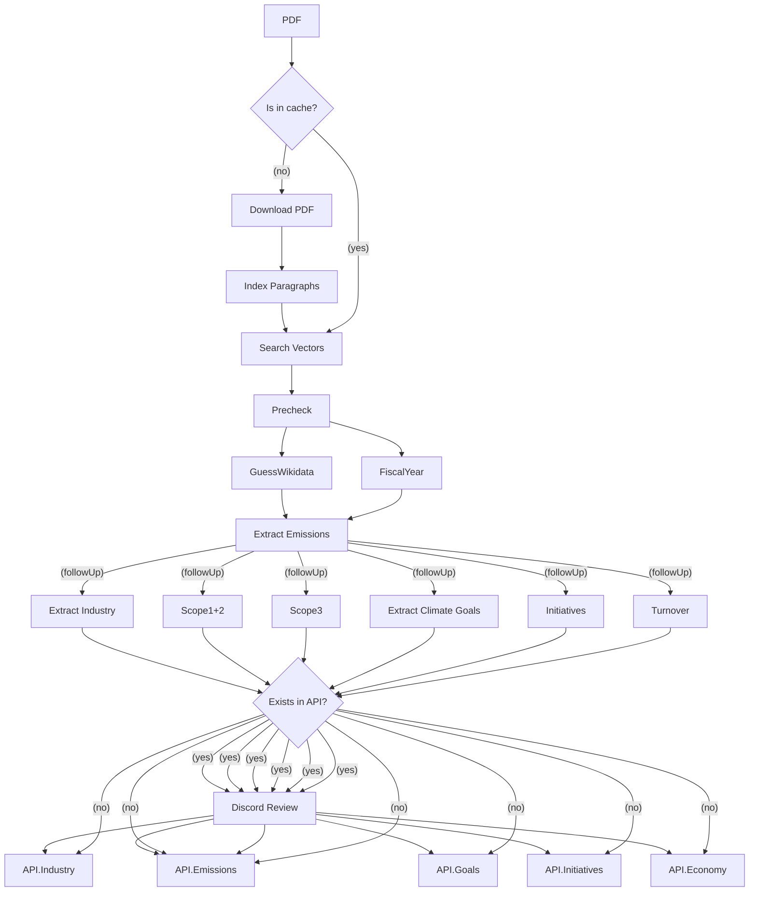

## Klimatkollen Garbo AI

This is the main repo for the AI bot we call Garbo. Garbo is a Discord bot that is powered by LLM:s to effectively fetch and extract GHG self reported data from companies.

Garbo is invoked through a set of commands in Discord and has a pipeline of tasks that will be started in order for her to both extract, evaluate and format the data autonomously.

We utilise an open source queue manager called BullMQ which relies on Redis. The data is then stored into DB and Wikidata.


## Current Status

Test the app in Discord channel #rapporter-att-granska by using the command /pdf <url> and Garbo will be answering with a parsed JSON

## Data Flow

Some of the following steps will be performed in parallel and most will be asynchronous. If a process is failed it's important to be able to restart it after a new code release so we can iterate on the prompts etc without having to restart the whole process again.



### Get Started

Get an OPENAI_API_KEY, POSTGRES_PASSWORD from OpenAI and add it to a .env.development (look in the .env.example) file in the root directory. Run redis, chromadb and postgresql locally like this:

```bash
npm i
docker run -d -p 6379:6379 redis
docker run -d -p 5432:5432 -e POSTGRES_PASSWORD=mysecretpassword postgres
docker run -d -p 8000:8000 chromadb/chroma
npm run dev
```

## How to run the code

The code consists of two different starting points. The first one will serve the BullMQ queue UI and will also be responsible for listening to new events from Discord.

```bash
npm run dev-board
```

Now you can go to <http://localhost:3000> and see the dashboard.

The second one is the workers responsible for doing the actual work. This part can be scaled horisontally and divide the work automatically through the queue.

```bash
npm run dev-workers
```

### How to run with Docker

To run the application

```bash
docker run -d -p 3000:3000 ghcr.io/klimatbyran/garbo npm start

# start how many workers you want:
docker run -d ghcr.io/klimatbyran/garbo npm run workers
docker run -d ghcr.io/klimatbyran/garbo npm run workers
docker run -d ghcr.io/klimatbyran/garbo npm run workers
```

### Operations / DevOps

This application is deployed in production with Kubernetes and uses FluxCD as CD pipeline. The yaml files in the k8s is automatically synced to the cluster. If you want to run a fork of the application yourself - just add these helm charts as dependencies:

```helm
postgresql (bitnami)
redis (bitnami)
chromadb
metabase
```

To create secret in the k8s cluster - use this command to transfer your .env file as secret to the cluster:

```bash
kubectl create secret generic env --from-env-file=.env
```

### License

MIT
