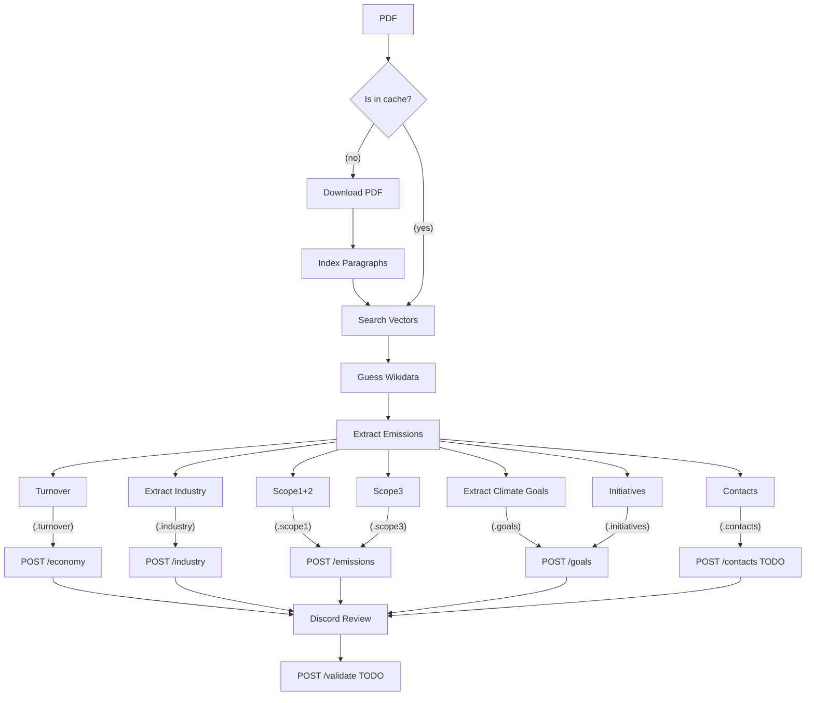

## Klimatkollen Garbo AI

This is the main repo for the AI bot we call Garbo. Garbo is a Discord bot that is powered by LLM:s to effectively fetch and extract GHG self reported data from companies.

Garbo is invoked through a set of commands in Discord and has a pipeline of tasks that will be started in order for her to both extract, evaluate and format the data autonomously.

We utilise an open source queue manager called BullMQ which relies on Redis. The data is then stored into DB and Wikidata.


## Current Status

Test the app in Discord channel #rapporter-att-granska by using the command /pdf <url> and Garbo will be answering with a parsed JSON

## Data Flow

Some of the following steps will be performed in parallel and most will be asynchronous. If a process is failed it's important to be able to restart it after a new code release so we can iterate on the prompts etc without having to restart the whole process again.



### Get Started

Get an OPENAI_API_KEY, POSTGRES_PASSWORD from OpenAI and add it to a .env file in the root directory. Run redis and postgresql locally or add REDIS_HOST and REDIS_PORT into the .env file.

```bash
npm i
docker run -d -p 6379:6379 redis
docker run -d -p 5432:5432 -e POSTGRES_PASSWORD=mysecretpassword postgres
docker run -d -p 8000:8000 chromadb/chroma
npm start & npm run workers
```

## How to run the code

The code consists of two different starting points. The first one will serve the BullMQ queue UI and will also be responsible for listening to new events from Discord.

```bash
npm start
```

Now you can go to http://localhost:3000 and see the dashboard.

The second one is the workers responsible for doing the actual work. This part can be scaled horisontally and divide the work automatically through the queue.

```bash
npm run workers
```

### Environment/Secrets

Create a .env file in the root lib and add these tokens/secrets before running the application:

```bash
OPENAI_API_KEY=
OPENAI_ORG_ID=
DISCORD_APPLICATION_ID=
DISCORD_TOKEN=
DISCORD_SERVER_ID=

# these are optional, the code works fine without Llama cloud:
LLAMA_CLOUD_API_KEY=
```

## How to run with nodemon

Either you run both workers and board in the same terminal with same command through `concurrently`

```bash
npm run dev
```

or you start them separately

```bash
npm run dev-workers
# new terminal:
npm run dev-board
```

### How to run with Docker

```bash
docker run -d -p 3000:3000 ghcr.io/klimatbyran/garbo npm start

# start how many workers you want:
docker run -d ghcr.io/klimatbyran/garbo npm run workers
docker run -d ghcr.io/klimatbyran/garbo npm run workers
docker run -d ghcr.io/klimatbyran/garbo npm run workers
```

### Next steps / Tasks

### Operations

This application is run in Kubernetes and uses FluxCD as CD pipeline. To create secret in the k8s cluster - use this command to transfer your .env file as secret to the application

```bash
kubectl create secret generic env --from-env-file=.env
```

### License

MIT
