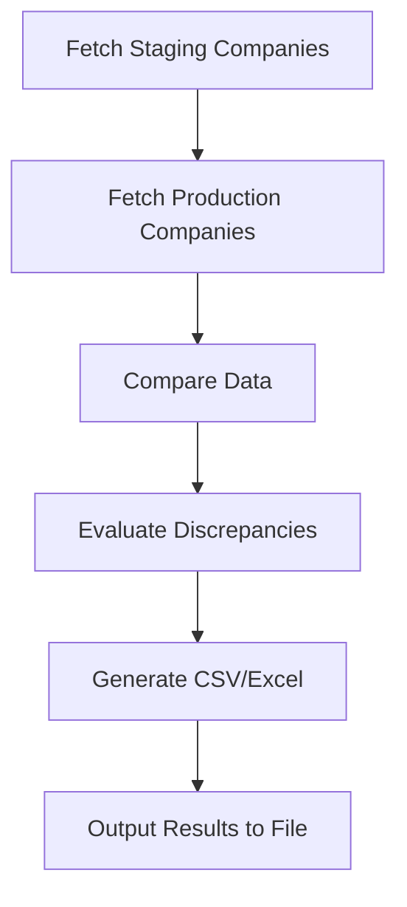

# Accuracy Script Documentation

This documentation provides an overview of the functionality of the accuracy comparison script, its input/output structure, and step-by-step breakdown of its execution flow. Similar to the Garbo Pipeline Documentation, it explains the process modularly, making it easy to follow.

---

## How is the Script Executed?

The accuracy script compares reporting data between two different environments: **staging** and **production**. It evaluates discrepancies (if any) and generates CSV and Excel files with metrics for analysis.

---

### Fetching Data

The script fetches companies’ reporting and emissions data from two specified environments using their respective API endpoints. The API tokens required for authentication are provided via environment variables.

__Code Snippet (Fetch Function)__: 

```typescript
async function fetchCompanies(baseURL: string) {
  const response = await fetch(`${baseURL}/companies`, {
    method: 'GET',
    headers: {
      Authorization: `Bearer ${tokens['garbo']}`, // Use the appropriate token
    },
  });
  if (!response.ok) {
    throw new Error(`Failed to fetch data from ${baseURL}: ${response.statusText}`);
  }
  return data;
}
```

### Input


```typescript
baseURL (string)
``` 
The base API endpoint for the target environment (either staging or production).

### Output
A company list JSON from the API.


## General Execution Flow


### Key Functions and Jobs
Below is the documentation for major functions and steps undertaken by the script:

### Fetch Companies

__Called By:__
Main function during the script initialization.

__Input:__
API URL (String)

__Output:__
Parsed JSON of company data in the following schema format:

```typescript
type CompanyList = z.infer<typeof schemas.CompanyList>
```

__Functionality:__
The function sends an authenticated GET request to fetch companies' data using environment-specified authorization tokens. The returned data includes details like `wikidataId`, `name`, and `reportingPeriods`.

### Compare Companies
__Called By:__
Main function after fetching data from staging and production environments.

__Input:__
`productionCompanies (CompanyList)`
`stagingCompanies (CompanyList)`

__Output:__
A consolidated list of `Company`objects containing discrepancies between the two datasets:

```typescript
interface Company {
  wikidataId: string,
  name: string;
  diffs: DiffReport[];
}
```

__Functionality:__
The function loops through each company in the production dataset and finds its counterpart in the staging dataset by matching `wikidataId`. It then compares `reportingPeriods` between the two, generating `DiffReport` objects that include detailed differences (broken down into emissions, economy metrics, and evaluation accuracy).

### Compare Reporting Periods
__Called By:__
`compareCompanyLists()`

__Input:__
`productionReportingPeriod (ReportingPeriod)`
`stagingReportingPeriod (ReportingPeriod)`
`productionCompany (CompanyResponse)`

__Output:__
A `DiffReport` object outlining all differences identified when comparing two corresponding reportingPeriods:

```typescript
interface DiffReport {
  reportingPeriod: {
    startDate: Date;
    endDate: Date;
  },
  diffs: {
    emissions: { ... },
    economy: { ... }
  },
  eval: {
    accuracy?: { description?: string, value?: number },
    accuracyNumericalFields?: { description?: string, value?: number },
    magnError?: number;
  }
}
```

__Functionality:__
This function compares key reporting metrics—including emissions breakdowns, economy metrics, and emissions scope categories—for two corresponding reporting periods. It computes absolute differences, percentage differences, and aggregates these into evaluation metrics.

__Example Comparison:__
```typescript
d.diffs.emissions.scope1  = compareNumbers(
  productionReportingPeriod.emissions?.scope1?.total,
  stagingReportingPeriod.emissions?.scope1?.total,
  productionReportingPeriod.emissions?.scope1?.metadata.verifiedBy != null
);
```

### Compare Numeric Fields

__Called By:__ 
`compareReportingPeriods()`

__Input:__
`productionNumber (number)`
`stagingNumber (number)`
`productionVerified (boolean)`

__Output:__
A `Diff` object:

```typescript
interface Diff {
  productionValue?: number;
  stagingValue?: number;
  difference?: number;
  differencePerct?: number;
}
```

__Functionality:__ 
Calculates the difference between corresponding numerical fields in staging and production data. In certain fields (e.g., emissions), the comparison operates only on verified data (controlled by the flag `ONLY_CHECK_VERIFIED_DATA`).

### Evaluate and Generate Accuracy Metrics
__Called By:__ 
`compareReportingPeriods()`

__Input:__
Array of `Diff` objects:

```typescript
Diff[]
```

__Output:__
An `eval` object summarizing various accuracy metrics:

```typescript
{
  accuracy,
  accuracyNumericalFields,
  magnError
}
```

__Key Metrics Computed:__
Accuracy: Proportion of all fields that are correct.
Accuracy for Numerical Fields: Proportion
Magnitude Error: proportion of numerical discrepancies caused by magnitude issues.

__Functionality:__
Aggregate `Diff`values across reporting periods to estimate the overall accuracy of staging-vs-production comparisons

### CSV and Excel Generation
__Called By:__ 
Main function after `evaluate`phase

__Input:__
An array of `company`objects containing diff and evaluation results

__Output:__
Two files in the /output directory:
`accuracy-results.csv`
`accuracy-results.xlsx`

__Example CSV Headers:__
WikidataId, name, reportingPeriodStart, reportingPeriodEnd, accuracy, accuracyNumericalFields, magnError

__Functionality:__
Converts evaluation results into tabular format for better usability, generating both a CSV string and an Excel workbook.

```typescript
function convertCompanyEvalsToCSV(companies: Company[]): string {
  // Format into rows
}
async function generateXLSX(data: string[]): Promise<Buffer> {
  // Format into Excel
}
```
### Main Execution Flow
__Triggered By:__
The `main()`function at the bottom of the script.

__steps:__
Fetches company data from both Staging and Production APIs using `fetchCompanies`.
Compares the two datasets using `compareCompanyLists`.
Evaluates discrepancies via `compareReportingPeriods`.
Outputs results (evaluation metrics) to both CSV and Excel formats using `convertCompanyEvalsToCSV` and `generateXLSX`.

## Appendix

### Data Types
__Reporting Period:__

```typescript
interface ReportingPeriod {
  startDate: string;
  endDate: string;
  emissions?: { ... };
  economy?: { ... };
}
```

__Diff Object:__

```typescript
interface Diff {
  productionValue?: number;
  stagingValue?: number;
  difference?: number;
  differencePerct?: number;
}
```

__Company Object:__

```typescript
interface Company {
  wikidataId: string;
  name: string;
  diffs: DiffReport[];
}
```

