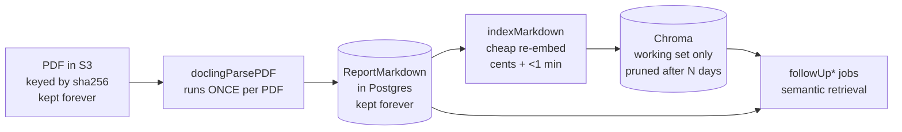

# Plan: ChromaDB storage — cleanup now, bounded storage forever

## Background

The `indexMarkdown` job is failing because the ChromaDB volume (`data-chromadb-0`, 25 Gi PVC in the `garbo` namespace — helm says 30 Gi but see Workstream 0) is full. Investigation findings:

- Chroma holds one collection, `emission_reports`. Every processed report is chunked (2000 chars, 200 overlap) and stored with an ada-002 embedding **plus a full copy of its parent paragraph in every chunk's metadata** (`src/lib/vectordb.ts`, `addReport`). A paragraph of length P is duplicated ~P/1800 times — 10–20× storage amplification, worse for reports with large sections.
- Nothing is ever deleted. Chunks are keyed `${url}#index`, so the same PDF indexed under different URLs (web URL vs. pipeline-api S3 URL) is stored in full multiple times.
- Chroma is also the **only** store of the Docling markdown output. `parsePdf` uses `vectorDB.hasReport(url)` as the "already parsed" cache. This is why nothing can be deleted today: deleting the index deletes the only copy of the expensive Docling parse.
- The deployment (infra repo, Amikos chart 0.2.2 → Chroma 1.5.3, `sqliteDb.migrationMode: apply`) was upgraded in place; legacy SQLite/WAL bloat may be occupying significant space and is never reclaimed without a vacuum.

## Target architecture

Markdown becomes a first-class, permanent artifact in Postgres. Chroma becomes a **disposable working-set cache** that can be pruned or rebuilt at any time.



Data lifecycle after this plan:

| Artifact | Store | Retention | Recreate cost |
|---|---|---|---|
| PDF | S3 (pipeline-api cache) | forever | — |
| Docling markdown | Postgres `ReportMarkdown` | forever | minutes of Docling (avoided) |
| Embeddings/index | Chroma | ~90 days since last use | cents, <1 min |
| Retrieved context per job | Postgres `ReportRunJob.markdown` | forever (already exists) | — |

---

## Workstream 0 — Reclaim space now (ops + infra repo, no app code)

Goal: get `indexMarkdown` unblocked this week. Safe to do immediately; none of this deletes parsed-markdown history.

### Findings from prod (2026-07-08)

```
data-chromadb-0 PVC: 25Gi, /data 100% full (1.1 MB free)
chroma.sqlite3:                    19 G   ← metadata + documents + WAL
f93df5ca-… (HNSW vector index):    5.5 G
```

- The PVC is **25 Gi even though helm values say 30 Gi**: StatefulSet volume claim templates are immutable, so changing `volumeSize` in the HelmRelease never resizes an existing volume. The PVC must be patched directly.
- SQLite at 3.5× the vector index confirms metadata (duplicated paragraphs) is the dominant consumer, not embeddings. The volume is only ~132 days old (created on Chroma 1.x, WAL auto-purge on), so expect vacuum to help moderately — the big reductions come from dedupe (step 4) and Workstream 3.
- With ~1 MB free, **vacuum is impossible** (it rebuilds the DB into a copy, needing ~19 G scratch) and even deletes may fail. Expansion must happen first.

### Steps

1. **Snapshot the PV** (Harvester VolumeSnapshot) before touching anything. The helm values already set `retentionPolicyOnDelete: Retain`.
2. **Expand the PVC directly** (this also resolves the immediate incident):

   ```bash
   kubectl get sc harvester -o jsonpath='{.allowVolumeExpansion}'   # must be true
   kubectl -n garbo patch pvc data-chromadb-0 \
     -p '{"spec":{"resources":{"requests":{"storage":"60Gi"}}}}'
   kubectl -n garbo describe pvc data-chromadb-0   # if FileSystemResizePending:
   kubectl -n garbo delete pod chromadb-0          # StatefulSet recreates it
   ```

   60 Gi = 25 G current + ~19 G vacuum scratch + headroom (PVCs cannot shrink later, but post-cleanup usage will stay far below). Update `volumeSize` in `infra/clusters/garbo/infrastructure/{prod,stage}/chromadb-helm.yaml` to match, with a comment that the value does not resize existing volumes. Verify `indexMarkdown` succeeds again.
3. **Vacuum**: stop writes (scale the worker deployment to 0). Check whether the 1.x server image ships the CLI (`kubectl -n garbo exec chromadb-0 -- chroma utils vacuum --help`); if not, scale chromadb to 0 and run a one-off Job with a Python image (`pip install chromadb`, PVC mounted) running `chroma utils vacuum --path /data`. Reclaims deleted pages/WAL and ensures auto-purge stays enabled.
4. **Delete duplicate sources**: script (garbo repo, `scripts/chroma-dedupe.ts`) that lists distinct `source` values in the collection, compares against the `Report` registry (`url`, `sourceUrl`, `s3Url` columns), and deletes Chroma sources that are non-canonical duplicates of the same registry row (same PDF indexed under a stale/alternate URL). Log everything deleted. Vacuum again after.

> ⚠️ Do **not** run any age-based deletion in this phase. Old entries are still the only copy of their Docling parse until Workstream 2 completes.

---

## Workstream 1 — Markdown becomes first-class (garbo repo)

Goal: every parsed report's markdown is durably stored in Postgres; the pipeline reads the cache from Postgres, not Chroma.

### 1.1 Schema (`prisma/schema.prisma` + migration)

```prisma
/// Docling output for a processed PDF. Source of truth for "has this PDF been parsed".
model ReportMarkdown {
  id           String   @id @default(cuid())
  /// Pipeline URL the report was processed under (matches Chroma `source` and job data `url`).
  url          String   @unique
  /// Content hash of the PDF when known — enables dedupe across URL variants.
  sha256       String?
  markdown     String
  /// True when recovered from Chroma metadata rather than saved directly from Docling.
  reconstructed Boolean @default(false)
  parsedAt     DateTime @default(now())

  @@index([sha256])
}
```

Notes:
- Postgres TOAST compresses large text automatically; no manual gzip needed. Expect ~100–300 KB effective per report, low single-digit GB for the whole corpus.
- `sha256` comes from the `Report` registry row when available (pipeline-api already computes it); a follow-up can make `Report` ↔ `ReportMarkdown` a real relation, not required for v1.

### 1.2 New module `src/lib/markdownStore.ts`

Small service with the story-telling names the codebase prefers:

- `saveReportMarkdown(url, markdown, { sha256?, reconstructed? })` — upsert by url; if `sha256` matches an existing row under a different url, reuse/point rather than store a second copy.
- `getReportMarkdown(url): Promise<string | null>` — lookup by url, falling back to sha256 via the `Report` registry (handles "same PDF, different URL").
- `hasReportMarkdown(url): Promise<boolean>`

### 1.3 Pipeline changes

| File | Change |
|---|---|
| `src/workers/indexMarkdown.ts` | After receiving markdown from the Docling child, call `saveReportMarkdown(url, markdown)` **before** `vectorDB.addReport`. Saving to Postgres first means a Chroma failure no longer loses the parse. |
| `src/workers/parsePdf.ts` | Cache check becomes `hasReportMarkdown(url)` (with `vectorDB.hasReport(url)` fallback during transition). `forceReindex` keeps its meaning: delete vector index AND stored markdown, re-run Docling. |
| `src/workers/precheck.ts` cached path | `parsePdf` currently builds `cachedMarkdown` via a Chroma similarity query just to find the company name. Replace with the stored markdown (first ~15k chars is what `extractCompanyName` walks through anyway). Fewer Chroma queries, better input. |
| `scripts/delete-report.ts` | Also delete the `ReportMarkdown` row (behind the same confirmation). |
| `scripts/dev-reset.ts` | Also truncate `ReportMarkdown`. |

### 1.4 Rollout

Deploy behind normal review; no feature flag needed — writes are additive and reads fall back to the old Chroma check. Verify in stage: process one new PDF, confirm `ReportMarkdown` row exists, re-enqueue the same URL, confirm Docling is skipped with log line `markdown cache hit (postgres)`.

---

## Workstream 2 — Backfill history (garbo repo, one-time)

Goal: every report currently in Chroma gets a `ReportMarkdown` row, so history is fully covered before anything is pruned.

1. Script `scripts/backfill-markdown-from-chroma.ts`:
   - list distinct `source` values in the collection
   - for each source without a `ReportMarkdown` row: `collection.get({ where: { source } })`, sort records by the numeric suffix of their `${url}#index` ids, take unique `paragraph` metadata values in order, rejoin (first paragraph as-is, subsequent prefixed `\n## `)
   - save with `reconstructed: true`
   - batch with the existing `withChromaLimit` semaphore pattern; resumable (skip sources already stored)
2. **Known lossiness**: the original split was on `\n##`, so `###`-level headings are slightly mangled on reconstruction. This is fine for LLM retrieval context (the paragraphs Chroma returns today have the same artifact). The `reconstructed` flag records which rows could be improved by a future re-parse if ever needed.
3. Run in stage first; in prod run as a k8s Job (pattern exists in `k8s/jobs/`). Completion criterion: `distinct Chroma sources without ReportMarkdown row = 0` (script prints this).

---

## Workstream 3 — Stop the amplification (garbo repo)

Goal: new Chroma writes shrink ~10×; retrieval behavior unchanged.

### 3.1 Write path (`src/lib/vectordb.ts`)

`addReport` splits markdown into merged paragraphs (existing logic). Changes:

- store `paragraphIndex: number` in chunk metadata **instead of** the full `paragraph` text
- keep `source`, `type`, `parsed` metadata as-is (needed for filtering, dedupe, and retention)
- chunk document text stays (Chroma requires the document for the embedding function; it's small)

The paragraph list itself is derived deterministically from the stored markdown, so it needs no separate table: add `getReportParagraphs(url)` to `markdownStore` that loads the markdown and applies the exact same split+merge function. Extract that split+merge into a shared pure function (`src/lib/markdownChunking.ts`) so write path and read path can never drift.

### 3.2 Read path (`src/lib/vectordb.ts`)

`getRelevantMarkdown`:

- query Chroma as today
- for hits with `paragraph` metadata (old-format entries): use it directly — **backward compatible during transition**
- for hits with `paragraphIndex`: resolve text via `getReportParagraphs(url)[index]`
- dedupe and join as today

Callers (`FollowUpWorker`, `precheck`, `assess`) are unchanged — same function, same output shape.

### 3.3 No index migration needed

Old entries keep working via the fallback; they age out naturally under Workstream 4 retention, or disappear when a report is re-indexed. No big-bang rewrite of the collection.

---

## Workstream 4 — Retention + reindex-on-demand (garbo repo)

Goal: Chroma holds only the working set, forever bounded; reruns on cold reports "just work".

### 4.1 Reindex-on-demand (`src/workers/parsePdf.ts`)

Third branch in the cache logic:

| State | Action |
|---|---|
| no markdown stored | full flow: Docling → indexMarkdown → precheck (today's cold path) |
| markdown stored + index exists | straight to precheck (today's warm path, now reading markdown from Postgres) |
| **markdown stored + index missing** | **new**: flow of indexMarkdown → precheck, passing the stored markdown in job data (`indexMarkdown` already accepts `job.data.markdown` — no Docling child needed) |

This is the piece that makes deletion safe: any rerun against a pruned report costs one embedding pass (~$0.02–0.05, <1 min), never a Docling parse.

### 4.2 Retention job

- BullMQ repeatable job (weekly), new tiny worker `src/workers/chromaRetention.ts` registered in `startWorkers.ts` — no new infra since workers already run.
- Logic: `collection.get` metadata-only, group by `source`, find sources whose newest `parsed` timestamp is older than `CHROMA_RETENTION_DAYS` (env, default 90) **and** which have a `ReportMarkdown` row (never prune the only copy — belt-and-braces even after backfill), then `collection.delete({ where: { source } })` per source.
- Log a summary (sources pruned, chunks deleted, distinct sources remaining) and post it to the ops Discord channel via the existing messaging utilities — this doubles as the heartbeat that the job is alive.
- Note: Chroma deletes don't shrink the SQLite file immediately; auto-purge (enabled by the Workstream 0 vacuum) plus HNSW segment cleanup keep it bounded. An occasional vacuum (e.g. quarterly, manual) fully compacts.

### 4.3 `forceReindex` semantics (validate frontend, no change required)

The rerun buttons in validate (`useJobRerunActions`, `useRunReportsPipeline`) go through pipeline-api → `parsePdf` job data unchanged. `forceReindex` still means "re-run Docling from scratch". The only user-visible difference is cold reruns showing the "Parsing…" step briefly for re-embedding — optional polish: a distinct message `♻️ Rebuilding search index from cached parse...` so operators don't think Docling is re-running.

---

## Cross-repo summary

| Repo | Changes |
|---|---|
| **garbo** | Workstreams 1–4: prisma migration, `markdownStore`, `markdownChunking`, `vectordb.ts` slimming, `parsePdf`/`precheck`/`indexMarkdown` updates, retention worker, backfill + dedupe scripts, script updates (`delete-report`, `dev-reset`), env vars `CHROMA_RETENTION_DAYS` added to `k8s/base/worker.yaml` + `.env.example` |
| **infra** | Workstream 0 (vacuum Job, optional volume bump in `chromadb-helm.yaml` stage+prod), monitoring section below |
| **pipeline-api** | No required changes. Optional improvement: always enqueue with the cached S3 URL (it already does when `cachePdf: true`) and pass `sha256` through job data so `ReportMarkdown.sha256` is populated at write time instead of via registry lookup |
| **validate** | No required changes. Optional: surface the "rebuilding index" message distinctly in run status UI |

Order of operations (safety-critical): **W0 (vacuum/dedupe) → W1 (store) → W2 (backfill) → W3 (slim writes) → W4 (retention)**. W3 and W4 can land together; retention must not be enabled before W2 reports zero uncovered sources.

---

## Monitoring & alerts

Infra already runs kube-prometheus-stack (Grafana persisted, **Alertmanager currently disabled**). Two options; recommended: use **Grafana-managed alerts** with a Discord webhook contact point (matches how the team already communicates), avoiding the Alertmanager enable/config work. Enable Alertmanager later if alert routing needs grow.

### Disk / capacity (prevents this incident recurring)

- `kubelet_volume_stats_available_bytes / kubelet_volume_stats_capacity_bytes` for the chromadb PVC: **warn < 30 % free, critical < 15 % free**. This is the alert that was missing this time. Add the same for the Postgres and Prometheus PVCs while at it.
- Chroma pod memory working set vs. its 8 Gi limit (HNSW is memory-hungry; OOM kills present as the flaky Chroma errors seen in `indexMarkdown` retries): warn > 80 %.

### Pipeline health (garbo)

- `indexMarkdown` failure alerting already surfaces per-run via job thread messages; add a Grafana alert on BullMQ failed-job counts if/when queue metrics are exported. Pragmatic v1: the retention job's weekly Discord summary includes failed `indexMarkdown` count from `ReportRunJob` (`status = 'failed'`, `queueName = 'indexMarkdown'`, last 7 days).
- **Docling re-run detector** (guards "never parse twice"): count of Docling runs for URLs that already had a `ReportMarkdown` row — should be ~0 outside explicit `forceReindex`. Include in the weekly summary; nonzero means the cache lookup regressed.
- **Coverage metric** (until W2 completes, then as a permanent invariant): distinct Chroma sources without a `ReportMarkdown` row. Must be 0 before retention is enabled; alert if ever > 0 afterward.

### Retention job health

- Weekly Discord summary post = heartbeat. Alert condition: no summary for > 8 days (Grafana alert on absence if metrics exist; otherwise a human-visible gap in the ops channel is acceptable for v1).
- Summary contents: sources pruned, chunks deleted, distinct sources remaining, estimated collection size, coverage metric, Docling re-run count.

### Dashboards

One Grafana dashboard: chroma PVC usage over time, chroma pod memory, distinct sources in collection (retention job can push this via Pushgateway later; v1 = logged numbers), `ReportMarkdown` row count and total bytes (`pg_column_size` sum), weekly Docling runs vs. cache hits.

---

## Rollback notes

- W1 is additive; rolling back is removing reads, the table can stay.
- W3 read path keeps the old-metadata fallback indefinitely; rolling back the write path just resumes fat metadata.
- W4 retention can be paused by removing the repeatable job; nothing pruned is unrecoverable (markdown + reindex-on-demand restore any report).
- The only irreversible step is deletion in W0 step 4 (dedupe) and W4 pruning — both gated on the registry/markdown-store checks described above, plus the W0 snapshot.

## Open questions

1. Retention window: 90 days default — right trade-off between rerun frequency and storage? (Operators rerun recent batches most; tune with data from the weekly summaries.)
2. Should `forceReindex` from validate get a lighter sibling ("re-embed only") once reindex-on-demand exists? Cheap to add, unclear if needed.
3. Populate `ReportMarkdown.sha256` from pipeline-api job data (small pipeline-api change) or registry lookup (garbo-only)? Registry lookup is enough for v1.
