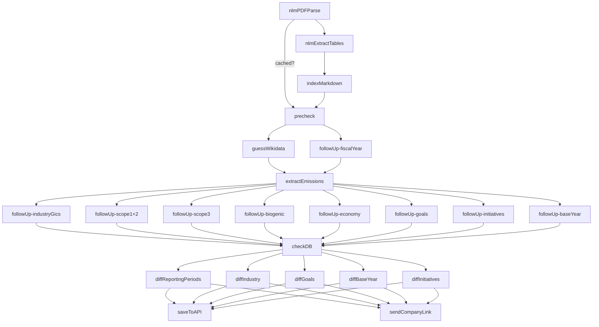
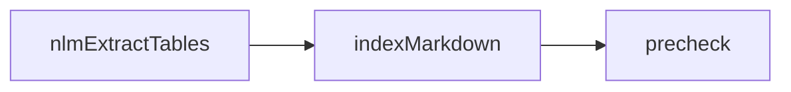

# Garbo Pipeline Documentation

This documentation tries to give an easy overview over the order of the pipeline steps, their functionality and structure of input and output. The documentation tries to explain the pipeline jobs in the execution order, parallel jobs will be explained after each other. 

## How are Jobs executed?

Pipeline jobs are executed by adding a job directly to the corresponding pipeline or creating a flow. A flow is used if a future job should await multiple previous jobs.

### Adding a Job to a Queue
To queue a job simply call the method `add()` on the `queue` property of the corresponding job class. The method takes a name for the job to be executed, its input data and additional options.

```typescript
pipelineStepX.queue.add(name: string, data: any: opts?: JobsOptions)
```

__Example__: 
```typescript
pipelineStepX.queue.add(
    "Dummy Job",
    {
        msg: "Hello World",
        currentYear: 2025
    }, 
    {
        backoff: {
            type: 'fixed',
            delay: 60_000,
        },
        attempts: 10,
    }
)
```

### Creating a Flow

To allow the creation of jobs depending on multiple other jobs, flows can be used. First a new object of class `FlowProducer` has to be created.

```typescript
const flow = new FlowProducer({ connection: redis })
```

In the creation a connection to the redis server is passed.

A flow than can be created by simply calling the method `add()` on the FlowProducer object.

```typescript
flow.add(flow: FlowJob, opts?: FlowOpts);
```

The `FlowJob` object looks like this:

```typescript
name: string
queueName: string,
data: any
chrildren: FlowJob[],
opts: FlowOpts
```

The property `name` specifies the display name of the job to run. `queueName` specifies the job class, `data` specifies the jobs input data, `children` specifies an array of children job on which the partent job depends on. The children jobs are therefore executed first. Last `opts` contains additional options for the job, like the number of attemps.

__Example:__

```typescript
await flow.add({
      name: 'Parent Job #1'
      queueName: 'parentJob', 
      data: { },
      children: [
        {
          name: 'Child #1',
          queueName: 'childrenJob1',
          opts: {failParentOnFailure: true},
          data: {user: 'Alice'},
        },
        {
          name: 'Child #2', 
          queueName: 'childrenJob2',         
          opts: {...baseOpts, failParentOnFailure: true},
          data: {
            ...baseInputData,
            type: JobType.FiscalYear,
          },
        },
      ],
      opts: {...baseOpts},
    })
```

## General Structure of the Pipeline



### nlmParsePDF

__Called By:__ `/pdfs` command of the discord bot defined in `src/discord/commands/pdfs.ts`.

__Input Data:__
```typescript
{
    url: string
    threadId: string,
    autoApprove: boolean
}
```

`url` defines the link at which the report is available, `threadId` references the discord thread in which the bot will answer and the flag `autoapprove` can be set to avoid the bot asking for approval for certain steps.

__Functionality:__
The job first downloads the report from the given url. It then checks if the report was already parsed, if so it directly passes over to a `precheck` job with the following input data:

```typescript
{
    url: string
    threadId: string,
    autoApprove: boolean
    cachedMarkdown: string
}
```

The first three properties are equal to the input of the job, `cachedMarkdown` is set to the exisiting parsed markdown fetched from the local VectorDB.

If the job has not been passed yet, the job uses methods to first convert the pdf to json and then to markdown. It then creates a flow in which first runs the job [nlmExtractTables](#nlmextracttables) with the following input data: 

```typescript
{
    url: string
    threadId: string,
    autoApprove: boolean
    json: string
}
```

The fields `url`, `threadId` and `autoApprove` are the same as the identical input fields of the job and the field `json` contains the extracted json from the input pdf.

In the flow the parent job of the job [nlmExtractTables](#nlmextracttables) is the job indexMarkdown which just gets the same input data as the current job nlmParsePDF. The same goes for the parent job of this job which is the job precheck. In summary the following flow is created:



### nlmExtractTables

__Called By:__ The flow construction in the job [nlmParsePDF](#nlmparsepdf) defined in `src/workers/nlmParsePDF.ts`

__Input Data:__

```typescript 
{
    url: string
    threadId: string,
    autoApprove: boolean
    json: string
}
```

The job receives the three standard input fields `url` , `threadId` and `autoApprove` as input data. Additionally, the field `json` containing containing the previously extracted json data from the input PDF is passed to the job as input data.

__Functionality:__

The job first detects the pages with tables on it using the nlmIngestor. For each page it then extracts the text of the tables as markdown using the vision API of ChatGPT. It then returns a string containing the extracted json as well as the markdown of the extracted tables.

__Return Value:__

```typescript
{
  markdown: string
}
```

The return value is an object containing a single field `markdown`. The field contains a string composited of the extracted json followed by an empty line and then the markdown of all extracted tables annotated with the page from which the corresponding markdown was extracted.

### indexMarkdown

__Called By:__ The flow construction in the job [nlmParsePDF](#nlmparsepdf) defined in `src/workers/nlmParsePDF.ts`

__Input Data:__

```typescript 
{
    url: string
    threadId: string,
    autoApprove: boolean
}
```

The job has the standard properties `url`, `threadId` and `autoApprove` as input data. Additionally, it collects the field `markdown` from the return of the job [nlmExtractTables](#nlmextracttables) which it awaits. 

__Functionality:__ 
The job first awaits it's child job [nlmExtractTables](#nlmextracttables) it then indexes the report in the format returned by the job [nlmExtractTables](#nlmextracttables) in to the VectorDB. It does not return any additional information

__Return Value:__ *none*

### precheck

__Called By:__ Either by flow construction in the job [nlmParsePDF](#nlmparsepdf) defined in `src/workers/nlmParsePDF.ts` or directly by the job [nlmParsePDF](#nlmparsepdf) defined in `src/workers/nlmParsePDF.ts`

__Input Data:__ 

```typescript 
{
    url: string
    threadId: string,
    autoApprove: boolean,
    cachedMarkdown?: string,
    companyName?: string
    type: JobType
}
```

Additionally, to the three standard fields the job gets three more input properties. Depending if the job was directly called by [nlmParsePDF](#nlmparsepdf) the field `cachedMarkdown` contains the cached markdown extraction which could be directly retrived from the VectorDB and passed to the job. The field `companyName` is deprecated and not used anymore, as the job determines the company name itself. The fiele `type` is also not set and only use to define the name of the wikidata schema.

__Functionality:__

The job first extracts the name of the company from the report using AI with the report as a context. It then uses AI to retrive a short company description from the report. After that it creates a flow with the job [extractEmissions](#extractemissions) as a parent job and passing the following data to it:

```typescript
{
    url: string
    threadId: string,
    autoApprove: boolean,
    companyName: string,
    description: string
}
```

With the first three properties being the standard ones and `companyName` and `description` containing the previously retriven values. This job gets assigned to child jobs [followUp](#followup) and [guessWikidata](#guesswikidata). Both again get the same input data as the parent job [extractEmissions](#extractemissions), but additionally the job [followUp](#followup) get the additional field `type` set to `JobType.FiscalYear` as an input property.

__Return Value:__ 

Job id of the created flow

### guessWikidata

__Called By:__ Called by the flow construction in the job [precheck](#precheck) defined in `src/workers/precheck.ts`.

__Input Data:__

```typescript
{
    url: string
    threadId: string,
    autoApprove: boolean,
    companyName: string,
    approved: boolean,
    wikidata: Wikidata,
    overrideWikidataId: EntityId
}
```

The job gets the three standard input properties and four additional ones. The field `companyName` contains the name of the company for which the job guesses the wikidata. `Approved` signals if the guessed wikidata has been approved and the job can proceed. `wikidata` contains the guessed wikidata and `overrideWikidataId` contains an entity id manually given by the user which should be used as the wikidata reference for the company to which the report belongs to.

__Functionality:__

The job first searches wikidata for entities by the matching the entity label to the company name. It checks if the found entities already have emission data and puts those on top of the list of found entities. It then queries an AI to find entity that seems to represent the company. The data of this entity is put into the field `wikidata` of the job's data. The hit is then shown to the user for approval and the job delays itself in the meantime. The approval action by the user sets the field `approved` to true. This leads the job in the next execution to return the found wikidata as a stringified json object. Alternatively, the user can give another wikidata entity id which in the next execution is used to retrive the wikidata of this entity and present it to the user for approval. 

__Return Value:__

Stringified object containing the field `wikidata` set to the wikidata of the found entity representing the company on wikidata.

### followUp

__Called by:__ The flow construction in the job [precheck](#precheck) defined in `src/workers/precheck.ts` or in the flow construction in the job [extractEmissions](#extractemissions) defined in `src/workers/extractEmissions.ts`

__Input Data:__

```typescript
{
    url: string
    threadId: string,
    autoApprove: boolean,
    type: JobType,
}
```

Despite the three standard properties the job expects the input property `type`. The property `type` defines on which type of data to follow up on. It can be one of the following:

```
IndustriyGics, Scope12, Scope3, Biogenic, Economy, 
Goals, Initiatives, FiscalYear, CompanyTags, BaseYear
```

__Functionality:__

The job retrives the relevant prompt, schema and query texts for the corresponding type and queries the relevant markdown parts of the report from the VectorDB.
It then sends the retrived prompt to an AI with the relevant markdowns as context and returns the response.

__Return Value:__

String containg the response from the AI.

### extractEmissions

__Called by:__ The flow construction in the job [precheck](#precheck) defined in `src/workers/precheck.ts`.

__Input Data:__

```typescript
{
    url: string
    threadId: string,
    autoApprove: boolean,
    companyName: string
}
```

Apart from the three standart input properties, the job additionally gets the property `companyName` containing the name of the company in the report. Also, the job first awaits the return value of it's two children  [followUp](#followup) and  [guessWikidata](#guesswikidata).

__Functionality:__
After awaiting it's children the job combines the return values of the childeren with its data in a new base object. It then creates a flow with the job [checkDB](#checkdb) as the parent job getting the input data: 

```typescript
{
    url: string
    threadId: string,
    autoApprove: boolean,
    companyName: string,
    wikidata: Wikidata,
    fiscalYear: {
      startMonth: number,
      endMonth: number
    }
}
```

The first four properties are just the jobs input properties and the last two `wikidata` and `fiscalYear` are filled with the corresponding information returned from the two child jobs. 

The job [checkDB](#checkdb) is assigned eight [followUp](#followup) child jobs of the following job types: 

```
IndustriyGics, Scope12, Scope3, Biogenic,
Economy, Goals, Initiatives, BaseYear
```

Each child job gets the same input data as the parent job [checkDB](#checkdb).

__Return Value:__ *none*

### checkDB

__Called By:__ The flow construction in the job [extractEmissions](#extractemissions) defined in `src/workers/extractEmissions.ts`. 

__Input Data:__

```typescript
{
    url: string
    threadId: string,
    autoApprove: boolean,
    companyName: string,
    wikidata: Wikidata,
    fiscalYear: {
      startMonth: number,
      endMonth: number
    }
}
```

The input data contains the three standard properties as well as the property `companyName` containg the company name, `wikidata` containing the corresponding wikidata and `fiscalYear` defining the fiscal year of the company. Also, the job awaits the return values of its eight children adding the following properties to the jobs data:

```typescript
{
    scope12,
    scope3,
    biogenic,
    industry,
    economy,
    baseYear,
    goals,
    initiatives
}
```

The exact type definitions of each property can be found at the end of the document.

__Functionality:__

After awaiting the return values of it's child jobs, the job queries the database to lookup if the company identified by it's wikidata id already exist. If not the job creates a new company with the respective name, wikidata id and description through the API. After that it creates a flow with the job [sendCompanyLink](#sendcompanylink) as a parent which gets the following input data:

```typescript
{
    url: string,
    threadId: string,
    autoApprove: boolean,
    companyName: string
    existingCompany: Company,     
    wikidata: Wikidata,
    fiscalYear: {
      startMonth: number,
      endMonth: number
    }   
}
```

The data object is identical to the job's input data with the addition of the property `existingCompany` containing the queried or newly created company object.

The job is assigned up to five different child jobs depending if certain return values of the previously awaited child jobs are not undefined. If either `scope12`, `scope3`, `biogenic` or `economy` is not undefined, the job [diffReportingPeriods](#diffreportingperiods) is added as a child job. Additionally, to the input data of it's parent job it receives the properties `scope12`, `scope3`, `biogenic` or `economy` of the previously awaited jobs.
If the property `industry` is not undefined the job [diffIndustry](#diffindustry) is added as a child job getting the same property in addition to the input data of it's parent job as input data.
If the property `goals` is not undefined the job [diffGoals](#diffgoals) is added as a child job getting the same property in addition to the input data of it's parent job as input data.
If the property `baseYear` is not undefined the job [diffBaseYear](#diffbaseyear) is added as a child job getting the same property in addition to the input data of it's parent job as input data.
If the property `initiatives` is not undefined the job [diffInitiatives](#diffinitiatives) is added as a child job getting the same property in addition to the input data of it's parent job as input data.

__Return Value:__ *none*

### diffReportingPeriods

__Called By:__ The flow construction in the job [checkDB](#checkDB) defined in `src/workers/checkDB.ts`. 

__Input Data:__

```typescript
{
    url: string,
    threadId: string,
    autoApprove: boolean,
    companyName: string
    existingCompany: Company,     
    wikidata: Wikidata,
    fiscalYear: {
        startMonth: number,
        endMonth: number
    },
    scope12?,
    scope3?,
    biogenic?,
    economy?,
}
```

The input data is similar to the input data of the calling job [checkDB](#checkDB), with the addition of the optional properties `scope12`, `scope3`, `biogenic` and `economy`. The first three representing the respecitve emission data retrived from the report by the corresponding [followUp](#followup) jobs and the last economy data about the company also retrived from the report using the speciallized [followUp](#followup) job.

__Functionality:__

As the four properties  `scope12`, `scope3`, `biogenic` and `economy` are structured as arrays with each entry containing data for a year, the job first identifies all unique years and for each year creates a seperate reporting period, identified by the year and specified by the fiscal year definition of the company. After that it fills the reporting periods with the data in the properties. It then uses a function to compare the retrived reporting period data with possibly existing data about the same reporting period in the API. If differences are found, these are represented in a diff and a approval flag is set if these diffs include the overwriting of exisiting data to make sure that that does not happen unintentionally. If the diff is not empty meaning that there are changes that could be pushed to the API the job queues a [saveToAPI](#savetoapi) job with the follwing input data:

```typescript
{
    url: string,
    threadId: string,
    autoApprove: boolean,
    companyName: string
    existingCompany: Company,     
    wikidata: Wikidata,
    fiscalYear: {
        startMonth: number,
        endMonth: number
    },
    body,
    diff,
    requiresApproval,
    apiSubEndpoint: 'reporting-periods'
}
```

Except for the properties identical to the job's input properties the properties `body`, `diff`, `requiresapproval` and `apiSubEndpoint` are added and the properties `scope12`, `scope3`, `biogenic` and `economy` are removed. The property `body` contains the updated reporting periods and metadata for the possible data update. `diff` contains information about the differences between the new and existing data. `requiresApproval` indicates if the update does require the approval of the user, and the property `apiSubEndpoint` specifies the corresponding for API endpoint for the update in this case `reporting-periods`.

__Return Value:__

```typescript
{
    body,
    diff,
    requiresApproval
}
```

The job returns the three properties `body`, `diff` and `requiresapproval`. The property `body` contains the updated reporting periods and metadata for the possible data update. `diff` contains information about the differences between the new and existing data and `requiresApproval` indicates if the update does require the approval of the user.

### diffIndustry

__Called By:__ The flow construction in the job [checkDB](#checkDB) defined in `src/workers/checkDB.ts`. 

__Input Data:__

```typescript
{
    url: string,
    threadId: string,
    autoApprove: boolean,
    companyName: string
    existingCompany: Company,     
    wikidata: Wikidata,
    fiscalYear: {
        startMonth: number,
        endMonth: number
    },
    industry?
}
```

The input data is similar to the input data of the calling job [checkDB](#checkDB), with the addition of the optional property `industry`. The property contains industry information about the company retrived from the report using the corresponding [followUp](#followup) job.

__Functionality:__

The job uses a method to compare the received industry data with possibly already existing industry data about the company in the API. The comparision returns a diff describing the possible difference between the new data and the data in the API and a flag `requiresApproval` representing if an update of the data requires the users approval to avoid unintentional overwrites. If there is a difference between the two data sets, the job enqueues a [saveToAPI](#savetoapi) job with the following data: 

```typescript
{
    url: string,
    threadId: string,
    autoApprove: boolean,
    companyName: string
    existingCompany: Company,     
    wikidata: Wikidata,
    fiscalYear: {
        startMonth: number,
        endMonth: number
    },
    body,
    diff,
    requiresApproval,
    apiSubEndpoint: 'reporting-periods'
}
```
Except for the properties identical to the job's input properties the properties `body`, `diff`, `requiresapproval` and `apiSubEndpoint` are added and the property `industry` is removed. The property `body` contains the updated industry data and metadata for the possible data update. `diff` contains information about the differences between the new and existing data. `requiresApproval` indicates if the update does require the approval of the user, and the property `apiSubEndpoint` specifies the corresponding for API endpoint for the update in this case `industry`.

__Return Value:__

```typescript
{
    body,
    diff,
    requiresApproval
}
```

The job returns the three properties `body`, `diff` and `requiresapproval`. The property `body` contains the updated industry and metadata for the possible data update. `diff` contains information about the differences between the new and existing data and `requiresApproval` indicates if the update does require the approval of the user.

### diffGoals

__Called By:__ The flow construction in the job [checkDB](#checkDB) defined in `src/workers/checkDB.ts`. 

__Input Data:__

```typescript
{
    url: string,
    threadId: string,
    autoApprove: boolean,
    companyName: string
    existingCompany: Company,     
    wikidata: Wikidata,
    fiscalYear: {
        startMonth: number,
        endMonth: number
    },
    goals: {
      description: string,
      year?: string,
      target?: number,
      baseYear?: string,
    }
}
```

The input data is similar to the input data of the calling job [checkDB](#checkDB), with the addition of the optional property `goals`. The property contains carbon emission goals information about the company retrived from the report using the corresponding [followUp](#followup) job.

__Functionality:__

The job uses a method to compare the received goals data with possibly already existing goals data about the company in the API. The comparision returns a diff describing the possible difference between the new data and the data in the API and a flag `requiresApproval` representing if an update of the data requires the users approval to avoid unintentional overwrites. If there is a difference between the two data sets, the job enqueues a [saveToAPI](#savetoapi) job with the following data: 

```typescript
{
    url: string,
    threadId: string,
    autoApprove: boolean,
    companyName: string
    existingCompany: Company,     
    wikidata: Wikidata,
    fiscalYear: {
        startMonth: number,
        endMonth: number
    },
    body,
    diff,
    requiresApproval,
    apiSubEndpoint: 'goals'
}
```
Except for the properties identical to the job's input properties the properties `body`, `diff`, `requiresapproval` and `apiSubEndpoint` are added and the property `goals` is removed. The property `body` contains the updated goals data and metadata for the possible data update. `diff` contains information about the differences between the new and existing data. `requiresApproval` indicates if the update does require the approval of the user, and the property `apiSubEndpoint` specifies the corresponding for API endpoint for the update in this case `goals`.

__Return Value:__

```typescript
{
    body,
    diff,
    requiresApproval
}
```

The job returns the three properties `body`, `diff` and `requiresapproval`. The property `body` contains the updated goals and metadata for the possible data update. `diff` contains information about the differences between the new and existing data and `requiresApproval` indicates if the update does require the approval of the user.

### diffBaseYear

__Called By:__ The flow construction in the job [checkDB](#checkDB) defined in `src/workers/checkDB.ts`. 

__Input Data:__

```typescript
{
    url: string,
    threadId: string,
    autoApprove: boolean,
    companyName: string
    existingCompany: Company,     
    wikidata: Wikidata,
    fiscalYear: {
        startMonth: number,
        endMonth: number
    },
    baseYear?: number
}
```

The input data is similar to the input data of the calling job [checkDB](#checkDB), with the addition of the optional property `baseYear`. The property contains base year information about the company retrived from the report using the corresponding [followUp](#followup) job.

__Functionality:__

The job uses a method to compare the received base year data with possibly already existing base year data about the company in the API. The comparision returns a diff describing the possible difference between the new data and the data in the API and a flag `requiresApproval` representing if an update of the data requires the users approval to avoid unintentional overwrites. If there is a difference between the two data sets, the job enqueues a [saveToAPI](#savetoapi) job with the following data: 

```typescript
{
    url: string,
    threadId: string,
    autoApprove: boolean,
    companyName: string
    existingCompany: Company,     
    wikidata: Wikidata,
    fiscalYear: {
        startMonth: number,
        endMonth: number
    },
    body,
    diff,
    requiresApproval,
    apiSubEndpoint: 'base-year'
}
```
Except for the properties identical to the job's input properties the properties `body`, `diff`, `requiresapproval` and `apiSubEndpoint` are added and the property `baseYear` is removed. The property `body` contains the updated base year data and metadata for the possible data update. `diff` contains information about the differences between the new and existing data. `requiresApproval` indicates if the update does require the approval of the user, and the property `apiSubEndpoint` specifies the corresponding for API endpoint for the update in this case `base-year`.

__Return Value:__

```typescript
{
    body,
    diff,
    requiresApproval
}
```

The job returns the three properties `body`, `diff` and `requiresapproval`. The property `body` contains the updated base year and metadata for the possible data update. `diff` contains information about the differences between the new and existing data and `requiresApproval` indicates if the update does require the approval of the user.

### diffInitatives

__Called By:__ The flow construction in the job [checkDB](#checkDB) defined in `src/workers/checkDB.ts`. 

__Input Data:__

```typescript
{
    url: string,
    threadId: string,
    autoApprove: boolean,
    companyName: string
    existingCompany: Company,     
    wikidata: Wikidata,
    fiscalYear: {
        startMonth: number,
        endMonth: number
    },
    initiatives: {
      title: string,
      description?: string,
      year?: string,
      scope?: string,
    }
}
```

The input data is similar to the input data of the calling job [checkDB](#checkDB), with the addition of the optional property `initatives`. The property contains information about initatives reducing the company's carbon footpring retrived from the report using the corresponding [followUp](#followup) job.

__Functionality:__

The job uses a method to compare the received initatives data with possibly already existing initatives data about the company in the API. The comparision returns a diff describing the possible difference between the new data and the data in the API and a flag `requiresApproval` representing if an update of the data requires the users approval to avoid unintentional overwrites. If there is a difference between the two data sets, the job enqueues a [saveToAPI](#savetoapi) job with the following data: 

```typescript
{
    url: string,
    threadId: string,
    autoApprove: boolean,
    companyName: string
    existingCompany: Company,     
    wikidata: Wikidata,
    fiscalYear: {
        startMonth: number,
        endMonth: number
    },
    body,
    diff,
    requiresApproval,
    apiSubEndpoint: 'initatives'
}
```
Except for the properties identical to the job's input properties the properties `body`, `diff`, `requiresapproval` and `apiSubEndpoint` are added and the property `initatives` is removed. The property `body` contains the updated initatives data and metadata for the possible data update. `diff` contains information about the differences between the new and existing data. `requiresApproval` indicates if the update does require the approval of the user, and the property `apiSubEndpoint` specifies the corresponding for API endpoint for the update in this case `initatives`.

__Return Value:__

```typescript
{
    body,
    diff,
    requiresApproval
}
```

The job returns the three properties `body`, `diff` and `requiresapproval`. The property `body` contains the updated initatives and metadata for the possible data update. `diff` contains information about the differences between the new and existing data and `requiresApproval` indicates if the update does require the approval of the user.

### saveToAPI

__Called By:__ On of the jobs [diffReportingPeriods](#diffreportingperiods), [diffIndustry](#diffindustry), [diffGoals](#diffgoals), [diffBaseYear](#diffbaseyear) and [diffInitiatives](#diffinitatives) in their corresponding files `src/workers/diff<type>.ts`.

__Input Data:__

```typescript
{
    url: string,
    threadId: string,
    autoApprove: boolean,
    companyName: string
    existingCompany: Company,     
    wikidata: Wikidata,
    fiscalYear: {
        startMonth: number,
        endMonth: number
    },
    approved?: boolean,
    requiresApproval: boolean,
    diff: string,
    body: any,
    apiSubEndpoint: string
}
```

Apart from the first seven properties which are identical to the previous jobs, the properties `approved`, `requiresApproval`, `diff`, `body` and `apiSubEndpoint` are passed as input to the job. `approved` indicated if the intended save to the API is already approved by a user and `requiresApproval` indicates if this approval is required at all. The propery `diff` contains a description of the changes to be applied to the API. `body` contains the data that could be pushed to the API to update the exisisting data and `apiSubEndpoint` indicated the API endpoint to which the update should be pushed.

__Functionality:__

If the API update is approved or the approval is not required the job sanatizes the body containg the updated data and updates the API through a request to the corresponding endpoint with the updated data in the request body. If an approval is required and not yet given the job asks the user for approval and delays itself.

__Return Value:__ *None*

### sendCompanyLink

__Called By:__ The flow construction in the job [checkDB](#checkDB) defined in `src/workers/checkDB.ts`. 

__Input Data:__
```typescript
{
    url: string,
    threadId: string,
    autoApprove: boolean,
    companyName: string
    existingCompany: Company,     
    wikidata: Wikidata
}
```

The input data is the same to the input data of the calling job.

__Functionality:__ 

The job checks if the companies url by querying the API with the wikidata id and name of the company. It then checks if the passed company object is not undefined and sends a link to the user referencing the frontend path to lookup the company and it's data.

__Return Value:__

```typescript
{
    url: string
}
```

The job returns the url to the company page.

## Appendix

### Datatype Definitions

**Base Year:**
   ```typescript
   baseYear: number
   ```

**Biogenic:**
   ```typescript
   biogenic: {
       year: number,
       biogenic: {
           total: number,
           unit: 'tCO2e' | 'tCO2',
       }
   }
   ```

**Company Tags:**
   ```typescript
   tags: ['public' | 'large-cap' | 'mid-cap' | 'state-owned' | 'municipality-owned' | 'private']
   ```

**Economy:**
   ```typescript
   economy: [
       {
           year: number,
           economy?: {
               turnover?: {
                   value?: number,
                   currency?: string,
               },
               employees?: {
                   value?: number,
                   unit?: 'FTE' | 'EOY' | 'AVG',
               }
           }
       }
   ]
   ```

**Fiscal Year:**
   ```typescript
   fiscalYear: {
       startMonth: number,
       endMonth: number
   }
   ```

**Goals:**
   ```typescript
   goals: [
       {
           description: string,
           year?: string,
           target?: number,
           baseYear?: string
       }
   ]
   ```

**IndustyGics:**
   ```typescript
   industry: {
       subIndustryCode: string
   }
   ```

**Initiatives:**
   ```typescript
   initiatives: [
       {
           title: string,
           description?: string,
           year?: string,
           scope?: string
       }
   ]
   ```

**Scope 1+2:**
   ```typescript
   scope12: [
       {
           year: numberm
           scope1?: {
               total: number,
               unit: 'tCO2e' | 'tCO2',
           },
           scope2?: {
               mb?: number,
               lb?: number,
               unknown?: number,
               unit: 'tCO2e' | 'tCO2',
           }
       }
   ]
   ```

**Scope 3:**

```typescript
scope3: [
    {
        year: number,
        scope3?: {
            categories?: [
                {
                    category: number,
                    total: number,
                    unit: 'tCO2e' | 'tCO2',
                }
            ],
            statedTotalEmissions: {
                total: number,
                unit: 'tCO2e' | 'tCO2',
            }
        }
    }
]
```